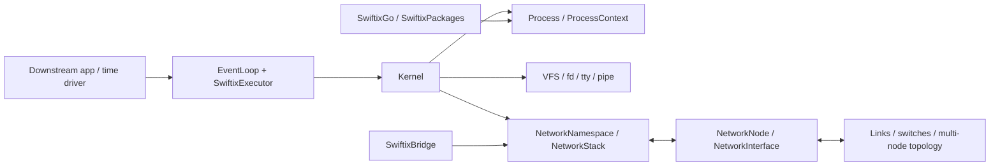

# Swiftix Core Architecture and Scope

> Last verified: 2026-08-15 
> Scope: the `Swiftix` core target

This document answers three questions: what the core owns, how its objects collaborate, and where downstream consumers connect. See the [README](../README.md) for installation and examples, and the links at the end for specialized contracts.

## Principles and Scope

- **One instance is one node:** the core models a single host; topology, links, devices, and UI belong downstream.
- **Pure Swift core:** `Sources/Swiftix` uses the Swift standard library and remains platform-independent.
- **Single-executor state:** one serial executor owns and drives each object graph.
- **Small, stable seams:** topology uses `NetworkNode`/`NetworkInterface`, terminals use `PseudoTerminal`, and platform networking uses an uplink transport.
- **Implementation is internal by default:** the public API is limited to documented consumer seams; VFS, process, socket, and protocol-parsing internals stay private.

The stable core is an embeddable single-node, logical-time runtime with a Swift-native process API, VFS/TTY model, and IPv4 network stack. Downstream products own topology, UI, devices, and distribution content. Namespaces, cgroups, block devices, and permissions expand only for bounded product or teaching scenarios; versioned expansion is tracked in the [product roadmap](roadmap.md).

### Linux Alignment Rule

Linux is the semantic reference for the small set of primitives Swiftix claims,
not an implementation blueprint or binary ABI. Core invariants should match
observable Linux behavior where doing so keeps the model smaller: process exit
and reap are distinct, descriptors reference shared open-file descriptions,
directory-entry names are separate from inodes, blocking operations support
multiple waiters, and pipe last-close drives EOF/EPIPE/SIGPIPE. Swiftix-specific
adaptation belongs at the public Swift API boundary rather than inside those
invariants.

The current profile is deliberately bounded:

| Area | Linux-aligned invariant | Explicit Swiftix boundary |
| --- | --- | --- |
| Process | live/run state is separate from terminal status and zombie retention | cooperative closure/bytecode tasks, not host threads or ELF `fork`/`exec` |
| File descriptors | `dup` and spawn inheritance share offsets, status flags, locks, and last-close | Swift-native descriptors, no syscall-number ABI |
| VFS | directory entries own names; hard links share one inode-like node | in-memory tree and a compact mount/snapshot model |
| Blocking I/O | FIFO waiter queues; EOF/teardown wake every affected waiter | one serial logical-time executor |
| Credentials | inherited uid/gid/groups, mode-bit checks, root/owner metadata rules | one effective-ID set; no ACLs, capabilities, saved IDs, or complete per-component path-search enforcement |
| cgroups | `pids.max` rejects creation; migration may move the group over limit | pids controller only; `spawn` reports refusal as PID `0` |
| UDP bind | a live binding cannot be silently displaced; port `0` is ephemeral | one owner per port; no `SO_REUSEADDR`/`SO_REUSEPORT` fanout yet |

This table is also the expansion rule: add a missing Linux behavior only when a
consumer needs it and it can be expressed as a tested extension of an existing
invariant. Do not import large Linux subsystems merely to increase parity.

## Object Relationships

One `EventLoop` can drive multiple `Kernel` instances. `ProcessContext` is the syscall-style facade for programs. `NetworkStack` implements `NetworkNode` and is internally layered by interface, routing, neighbors, IPv4, transport, and observability.

### Application and Isolation Boundary

A `Kernel` is the largest isolation unit owned by the core: it contains one
process table, VFS, network stack, lifecycle scope, and set of attached storage
volumes. A downstream application runtime may manage several Kernels on one
EventLoop, but that control plane does not become a guest syscall. An in-guest
CLI may talk to the runtime through an explicit service protocol; ordinary
`ProcessContext` code cannot create or control sibling Kernels.

This is the preferred first-party container model. One application sandbox maps
to one Kernel plus a validated rootfs, network attachment, explicit volumes,
resource limits, and an entry point. Restart, health, log retention, image
selection, and port-mapping policy remain downstream. PID, UTS, and mount
namespaces inside a Kernel remain useful process-isolation primitives, but they
are not prerequisites for duplicating a complete Linux container stack.

## Execution and Lifecycle

- Time is logical and advances only through `advance(by:)`, `runNext()`, and `runUntilIdle()`.
- Blocking syscalls suspend and resume through park/wake and `IOReadiness`; async frontends return to the bound `SwiftixExecutor`.
- Owner scopes support pause, resume, and cancel; event tokens can physically remove timers.
- The Go VM uses an instruction quantum so ready kernel work cannot be starved indefinitely.
- `Kernel.pause/resume/shutdown` manages process work and network timers together, and node destruction cancels owned work.

### Process State Model

Swiftix models Linux-visible process behavior without copying Linux's internal
`task_struct` or pretending that a cooperative Swift closure is a host thread.
The model has three separate layers:

1. **Retained identity:** PID, PPID, process group, session, namespaces, name,
   arguments, credentials, and terminal identity.
2. **Live runtime:** per-process callback scope, file descriptors, pending
   signals, signal handlers, and a structured registry of outstanding waits.
3. **Derived Linux view:** `R`, `S`, `T`, and `Z` as shown by `ps`, `top`, and
   procfs.

Run state (`runnable`, `running`, `waiting`, `stopped`) is independent from
lifecycle (`live`, transient `exiting`, `zombie`). The separation is an
invariant: stop/continue are live state changes; exit/signaled are terminal
results; a stopped process can never also be a zombie.

Logical exit is two-phase. First, Swiftix cancels the process's owned callbacks
and waits, closes descriptors, records an explicit `ProcessExitStatus`, and
notifies the parent. A child with a live parent then remains as a lightweight
zombie until a matching `wait`/`waitpid` consumes the terminal event. Only that
reap removes the PID and namespace identity. Host-owned processes (`PPID == 0`)
are reaped automatically. When a parent exits, children are adopted by PID 1 in
their PID namespace or an ancestor namespace when available; otherwise the host
becomes their owner.

`SIGSTOP`/`SIGKILL` are unmaskable, `SIGTSTP` uses its default job-control stop,
and `SIGCONT` resumes before optional handler delivery. Parents can observe
stopped and continued transitions with `WUNTRACED` and `WCONTINUED`-style
`ProcessWaitOptions`.

`Kernel.snapshotProcesses()` is the stable diagnostic seam. It includes
zombies, exit results, queued steps, pending signals, descriptor counts, and
human-readable wait reasons. `Kernel.processCount` and
`ResourceSnapshot.processes` count retained identities; the resource snapshot
also reports live and zombie counts separately. A future service supervisor
should consume exit events and these value snapshots while keeping restart,
backoff, health, and log-retention policy outside the process kernel.

## I/O, Resources, and Network Paths

`FileObject` unifies regular files, pipes/FIFOs, PTYs, and UDP/TCP sockets.
Descriptors point to a shared open-file description, which owns status flags and
the underlying object lifetime; independent `open` calls create independent
descriptions. Blocking reads use one-shot FIFO wait queues, while poll/select
readiness listeners remain broadcast snapshots. Every important long-lived queue
has an explicit capacity and full-queue policy:

| Object | Boundary |
| --- | --- |
| Pipes/FIFOs and PTYs | Fixed byte capacity; readiness represents blocking and writable recovery |
| UDP inbox | Limits both datagram count and total bytes; drops new datagrams and counts them when full |
| ARP pending | Global, per-neighbor, and byte limits; emits drop events |
| TCP receive | Receive-buffer and advertised-window limits |
| Packet history | Fixed-capacity ring that overwrites the oldest event |

These boundaries prevent stalled consumers from growing protocol queues without limit, but they are not equivalent to Linux memory management. The host still manages total VFS size and the Swift heap.

Regular VFS files remain in-memory. Page-oriented applications can use
`pread`/`pwrite` so shared open-file-description offsets never become a pager
race. Durable application storage uses an attached `BlockVolume`: operations
complete asynchronously on the Swiftix-driving executor, and `flush` is the
explicit crash-durability barrier. The core supplies `RamDisk`; platform-backed
volume implementations stay outside the core and must document their crash
model. Filesystem snapshots remain cold whole-tree persistence and are not a
substitute for a database commit barrier.

Outbound path:

`ProcessContext/socket` → transport → routing → ARP → IPv4/Ethernet → `onEgress`.

Inbound path:

`NetworkNode.receive` → Ethernet/IPv4 validation → local/forward decision → ICMP/UDP/TCP demultiplexing → socket or parked reader.

The observability surface includes interface counters, a trace hook, packet-path and drop events, TCP snapshots, and `/proc/net/*`.

## Capability Contract

| Area | Contract |
| --- | --- |
| Processes and scheduling | Logical-time cooperative scheduling with spawn, wait, signals, job control, timers, and park/wake |
| VFS and file descriptors | tmpfs, links, FIFOs, flock, positional I/O, mode permissions, mount snapshots, and poll/select |
| Storage volumes | Injectable asynchronous sector volumes with bounded geometry, typed failures, and an explicit flush barrier; RamDisk is the in-core implementation |
| TTY and IPC | PTYs, pipes, signals, and the terminal controls used by the Swiftix shell and applications |
| Namespaces and cgroups | UTS, PID, and mount namespaces plus the pids controller for teaching scenarios |
| IPv4 networking | Virtual Ethernet, ARP, IPv4, ICMP, UDP, TCP, DNS, routing, forwarding, and observability |
| TCP | Bounded sockets with RTO, Reno/CUBIC, fast recovery, window scaling, SACK, and zero-window handling |
| Uplink | Optional SLIRP-style TCP/UDP relay through the platform adapter |
| Userland | Swiftix shell and command APIs, Swiftix Go runtime, `pkg`, and distribution-provided base packages |

This contract supports network education and small-to-medium IPv4 simulations. Compatibility work outside it requires a concrete consumer, bounded API, and verification plan.

## Target Boundaries

| Target | Responsibility |
| --- | --- |
| `Swiftix` | Single-node core; depends on no other package target |
| `SwiftixBridge` | Apple `Network.framework` uplink |
| `SwiftixGo*` | Compiler, VM, runtime, and tool frontends |
| `SwiftixImage` | Rootfs codec, validation, and atomic restore |
| `SwiftixPackages` | Package format, repository, solver, and transactional installation |
| `Example/` | Standalone consumer example |

Before 1.0, feature work is limited to release hardening. Post-1.0 priorities and explicitly deferred capabilities are maintained in the [product roadmap](roadmap.md).

## Specialized Contracts

- [Go Toolchain](go-toolchain.md)
- [Package Management](package-manager.md)
- [Performance](performance.md)
- [Product Roadmap](roadmap.md)
