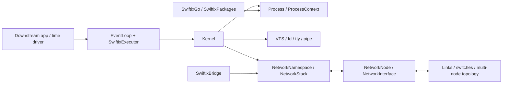

# Swiftix Core Architecture and Scope

> Last verified: 2026-08-15 
> Scope: the `Swiftix` core target

This document answers three questions: what the core owns, how its objects collaborate, and where downstream consumers connect. See the [README](../README.md) for installation and examples, and the links at the end for specialized contracts.

## Principles and Scope

- **One instance is one node:** the core models a single host; topology, links, devices, and UI belong downstream.
- **Pure Swift core:** `Sources/Swiftix` uses the Swift standard library and remains platform-independent.
- **Single-executor state:** one serial executor owns and drives each object graph.
- **Small, stable seams:** topology uses `NetworkNode`/`NetworkInterface`, terminals use `PseudoTerminal`, and platform networking uses an uplink transport.
- **Implementation is internal by default:** the public API is limited to documented consumer seams; VFS, process, socket, and protocol-parsing internals stay private.

The stable core is an embeddable single-node, logical-time runtime with a Swift-native process API, VFS/TTY model, and IPv4 network stack. Downstream products own topology, UI, devices, and distribution content. Namespaces, cgroups, block devices, and permissions expand only for bounded product or teaching scenarios; versioned expansion is tracked in the [product roadmap](roadmap.md).

## Object Relationships

One `EventLoop` can drive multiple `Kernel` instances. `ProcessContext` is the syscall-style facade for programs. `NetworkStack` implements `NetworkNode` and is internally layered by interface, routing, neighbors, IPv4, transport, and observability.

## Execution and Lifecycle

- Time is logical and advances only through `advance(by:)`, `runNext()`, and `runUntilIdle()`.
- Blocking syscalls suspend and resume through park/wake and `IOReadiness`; async frontends return to the bound `SwiftixExecutor`.
- Owner scopes support pause, resume, and cancel; event tokens can physically remove timers.
- The Go VM uses an instruction quantum so ready kernel work cannot be starved indefinitely.
- `Kernel.pause/resume/shutdown` manages process work and network timers together, and node destruction cancels owned work.

## I/O, Resources, and Network Paths

`FileObject` unifies regular files, pipes/FIFOs, PTYs, and UDP/TCP sockets. Every important long-lived queue has an explicit capacity and full-queue policy:

| Object | Boundary |
| --- | --- |
| Pipes/FIFOs and PTYs | Fixed byte capacity; readiness represents blocking and writable recovery |
| UDP inbox | Limits both datagram count and total bytes; drops new datagrams and counts them when full |
| ARP pending | Global, per-neighbor, and byte limits; emits drop events |
| TCP receive | Receive-buffer and advertised-window limits |
| Packet history | Fixed-capacity ring that overwrites the oldest event |

These boundaries prevent stalled consumers from growing protocol queues without limit, but they are not equivalent to Linux memory management. The host still manages total VFS size and the Swift heap.

Outbound path:

`ProcessContext/socket` → transport → routing → ARP → IPv4/Ethernet → `onEgress`.

Inbound path:

`NetworkNode.receive` → Ethernet/IPv4 validation → local/forward decision → ICMP/UDP/TCP demultiplexing → socket or parked reader.

The observability surface includes interface counters, a trace hook, packet-path and drop events, TCP snapshots, and `/proc/net/*`.

## Capability Contract

| Area | Contract |
| --- | --- |
| Processes and scheduling | Logical-time cooperative scheduling with spawn, wait, signals, job control, timers, and park/wake |
| VFS and file descriptors | tmpfs, links, FIFOs, flock, mode permissions, mount snapshots, and poll/select |
| TTY and IPC | PTYs, pipes, signals, and the terminal controls used by the Swiftix shell and applications |
| Namespaces and cgroups | UTS, PID, and mount namespaces plus the pids controller for teaching scenarios |
| IPv4 networking | Virtual Ethernet, ARP, IPv4, ICMP, UDP, TCP, DNS, routing, forwarding, and observability |
| TCP | Bounded sockets with RTO, Reno/CUBIC, fast recovery, window scaling, SACK, and zero-window handling |
| Uplink | Optional SLIRP-style TCP/UDP relay through the platform adapter |
| Userland | Swiftix shell and command APIs, Swiftix Go runtime, `pkg`, and distribution-provided base packages |

This contract supports network education and small-to-medium IPv4 simulations. Compatibility work outside it requires a concrete consumer, bounded API, and verification plan.

## Target Boundaries

| Target | Responsibility |
| --- | --- |
| `Swiftix` | Single-node core; depends on no other package target |
| `SwiftixBridge` | Apple `Network.framework` uplink |
| `SwiftixGo*` | Compiler, VM, runtime, and tool frontends |
| `SwiftixImage` | Rootfs codec, validation, and atomic restore |
| `SwiftixPackages` | Package format, repository, solver, and transactional installation |
| `Example/` | Standalone consumer example |

Before 1.0, feature work is limited to release hardening. Post-1.0 priorities and explicitly deferred capabilities are maintained in the [product roadmap](roadmap.md).

## Specialized Contracts

- [Go Toolchain](go-toolchain.md)
- [Package Management](package-manager.md)
- [Performance](performance.md)
- [Product Roadmap](roadmap.md)
