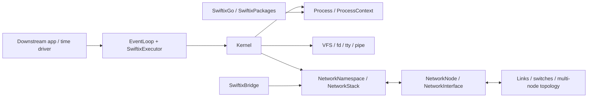

# Swiftix Core Architecture and Scope

> Last verified: 2026-10-07 
> Scope: the `Swiftix` core target

This document answers three questions: what the core owns, how its objects collaborate, and where downstream consumers connect. See the [README](../README.md) for installation and examples, and the links at the end for specialized contracts.

## Principles and Scope

- **One instance is one node:** the core models a single host; topology, links, devices, and UI belong downstream.
- **Pure Swift core:** `Sources/Swiftix` uses the Swift standard library and remains platform-independent.
- **Single-executor state:** one serial executor owns and drives each object graph.
- **Small, stable seams:** topology uses `NetworkNode`/`NetworkInterface`, terminals use `PseudoTerminal`, and platform networking uses an uplink transport.
- **Implementation is internal by default:** the public API is limited to documented consumer seams; VFS, process, socket, and protocol-parsing internals stay private.

The stable core is an embeddable single-node, logical-time runtime with a Swift-native process API, VFS/TTY model, and IPv4 network stack. Downstream products own topology, UI, devices, and distribution content. Namespaces, cgroups, block devices, and permissions expand only for bounded product or teaching scenarios; versioned expansion is tracked in the [product roadmap](roadmap.md).

### Linux Alignment Rule

Linux is the semantic reference for the small set of primitives Swiftix claims,
not an implementation blueprint or binary ABI. Core invariants should match
observable Linux behavior where doing so keeps the model smaller: process exit
and reap are distinct, descriptors reference shared open-file descriptions,
directory-entry names are separate from inodes, blocking operations support
multiple waiters, pipe last-close drives EOF/EPIPE/SIGPIPE, and socket last-close
drives the TCP FIN or reset. Swiftix-specific
adaptation belongs at the public Swift API boundary rather than inside those
invariants.

The current profile is deliberately bounded:

| Area | Linux-aligned invariant | Explicit Swiftix boundary |
| --- | --- | --- |
| Process | live/run state is separate from terminal status and zombie retention | cooperative closure/bytecode tasks, not host threads or ELF `fork`/`exec` |
| File descriptors | `dup` and spawn inheritance share offsets, status flags, locks, and last-close | Swift-native descriptors, no syscall-number ABI |
| VFS | directory entries own names; hard links share one inode-like node | in-memory tree and a compact mount/snapshot model |
| Blocking I/O | FIFO waiter queues; EOF/teardown wake every affected waiter | one serial logical-time executor |
| Credentials | inherited uid/gid/groups, mode-bit checks, search permission on every path component, root/owner metadata rules | one effective-ID set; no ACLs, capabilities, or saved IDs; `..` is collapsed lexically before the walk; `mount`/`umount` need uid 0 rather than a capability |
| TCP close | the last descriptor closing (close, exit, or kill) sends FIN after pending data, or RST when received data was never read; orphans reset new data | no `shutdown(2)` half-close call, `SO_LINGER`, or `SIGPIPE`/`EPIPE` on a reset socket; orphan FIN_WAIT_2 is bounded at 60 s and orphan zero-window probing at 8 probes |
| cgroups | `pids.max` rejects creation; migration may move the group over limit | pids controller only; `spawn` reports refusal as PID `0` |
| UDP bind | a live binding cannot be silently displaced; port `0` is ephemeral | one owner per port; no `SO_REUSEADDR`/`SO_REUSEPORT` fanout yet |

This table is also the expansion rule: add a missing Linux behavior only when a
consumer needs it and it can be expressed as a tested extension of an existing
invariant. Do not import large Linux subsystems merely to increase parity.

## Object Relationships

```mermaid
flowchart LR
    Driver["Downstream app / time driver"] --> Loop["EventLoop + SwiftixExecutor"]
    Loop --> Kernel["Kernel"]
    Kernel --> Process["Process / ProcessContext"]
    Kernel --> VFS["VFS / fd / tty / pipe"]
    Kernel --> Net["NetworkNamespace / NetworkStack"]
    Net <--> Seam["NetworkNode / NetworkInterface"]
    Seam <--> Topology["Links / switches / multi-node topology"]
    Bridge["SwiftixBridge"] --> Net
    Optional["SwiftixGo / SwiftixPackages"] --> Process
```

One `EventLoop` can drive multiple `Kernel` instances. `ProcessContext` is the syscall-style facade for programs. `NetworkStack` implements `NetworkNode` and is internally layered by interface, routing, neighbors, IPv4, transport, and observability.

### Application and Isolation Boundary

A `Kernel` is the largest isolation unit owned by the core: it contains one
process table, VFS, network stack, lifecycle scope, and set of attached storage
volumes. A downstream application runtime may manage several Kernels on one
EventLoop, but that control plane does not become a guest syscall. An in-guest
CLI may talk to the runtime through an explicit service protocol; ordinary
`ProcessContext` code cannot create or control sibling Kernels.

This is the preferred first-party container model. One application sandbox maps
to one Kernel plus a validated rootfs, network attachment, explicit volumes,
resource limits, and an entry point. Restart, health, log retention, image
selection, and port-mapping policy remain downstream. PID, UTS, and mount
namespaces inside a Kernel remain useful process-isolation primitives, but they
are not prerequisites for duplicating a complete Linux container stack.

## Execution and Lifecycle

- Time is logical and advances only through `advance(by:)`, `runNext()`, and `runUntilIdle()`.
- Blocking syscalls suspend and resume through park/wake and `IOReadiness`; async frontends return to the bound `SwiftixExecutor`.
- Owner scopes support pause, resume, and cancel; event tokens can physically remove timers.
- The Go VM uses an instruction quantum so ready kernel work cannot be starved indefinitely.
- A CPU-bound process gives up the processor with `ProcessContext.yield` (`try await ctx.yield()` in an `async` body, `yield(resume:)` otherwise), not a zero-length sleep. The Go quantum, `awk`, `bc`, and shell `while`/`until` loops do. A yield keeps its place among ready work but does not hold logical time; see [Real-Time Driving](#real-time-driving).
- `Kernel.pause/resume/shutdown` manages process work and network timers together, and node destruction cancels owned work.

### Real-Time Driving

A real-time host calls `EventLoop.advance(by:stepBudget:)` with the time that
elapsed since its previous call and the amount of work it can afford.

- **Timers and executor jobs hold the clock.** They run in deadline order at
  exactly their deadline. If the budget runs out first, the call returns
  `.budgetExceeded` with `now` at the last event processed, short of the
  target, and nothing is skipped.
- **Yielded CPU-bound work does not.** Inside the window, a timer that is due
  later runs after at most 8 consecutive yields. When the budget runs out and
  yields are the only work left in the window, `now` still reaches the target;
  the result is `.budgetExceeded` because ready work remains.
- **An `async` task that yields resumes as executor jobs, and those count as
  yields.** The Swift runtime posts a job for the resumption and another each
  time the running task switches executor context, so a task runs as a chain
  of jobs. The loop marks the job that resumes a yielded task, and every job
  posted while a marked job runs. The chain ends when the task waits for
  something (a sleep, a pipe, a child): whatever wakes it is ordinary work
  again. Until its first yield a task is ordinary work too, so a long
  computation should yield early, not only every N iterations.
- **Host contract.** Treat `.budgetExceeded` as "call again soon", and compare
  `now` with the frame's own target: if it is short, advance by the remainder
  rather than discarding it, or guest time falls behind. The step budget is how
  much CPU-bound work one interval holds, so a busy process gets further per
  frame with a larger budget while timer times stay the same. Runs driven the
  same way are identical.
- `runUntilIdle()` and `runNext()` are unchanged: they never move the clock
  past ready work, yields included.

Reads from an endless device (`/dev/zero`, `/dev/full`, `/dev/random`,
`/dev/urandom`) through the blocking or async frontend resume as yields as
well, because such a read never waits for anything: `cat /dev/zero > /dev/null`
does not hold the clock.

A process step queued while yielded work runs is a yield as well. When a
spinning process wakes another one (through a pipe it filled or drained, by
starting it, or by exiting), the woken step is part of the same burst, so
`yes | cat > /dev/null` does not hold the clock even though `cat` never
yields. A process woken by anything else (a timer, terminal input, the
network) takes an ordinary step, which ends the burst for it. The rule needs
one side to yield: two processes that only ever wake each other, with no
yield anywhere, are ordinary work and still hold the clock.

### Host-Owned Machine State

Real time and power belong to the host, so the core exposes them as small
`Kernel` seams instead of reading a platform clock or ending its own lifecycle.
`Kernel.wallClock` (set with `setWallClock(epochSeconds:utcOffsetSeconds:zoneAbbreviation:)`)
maps logical time to epoch time and a fixed zone; its default is the
deterministic "logical zero is the Unix epoch, UTC", and file timestamps are
stamped with it: every created node gets all three times, and a directory's
mtime/ctime follow the entries added to, removed from, or renamed in it.
Restoring a snapshot or image keeps the stored times. Nodes the kernel itself
provides (`/dev/null`, `/proc/uptime`) are dated at boot on the current
mapping, and computed ones (`/proc/<pid>`) at the time of the lookup.
`uptime` and `/proc/uptime` count logical seconds since boot, so they trail
`date` by whatever real time the host did not advance and later bridged with
`setWallClock`. `Kernel.onPowerRequest` receives `.shutdown`/`.reboot` when a
uid-0 guest calls `ProcessContext.requestPower` (`shutdown`, `reboot`,
`poweroff`, `halt`); it runs on the kernel executor from a kernel-owned job, the
core never acts on the request itself, and without a handler the commands fail
with "not supported by this host". `Kernel.seedRandom(_:)` seeds the
deterministic, non-cryptographic generator behind `/dev/random` and
`/dev/urandom`.

### Process State Model

Swiftix models Linux-visible process behavior without copying Linux's internal
`task_struct` or pretending that a cooperative Swift closure is a host thread.
The model has three separate layers:

1. **Retained identity:** PID, PPID, process group, session, namespaces, name,
   arguments, credentials, and terminal identity.
2. **Live runtime:** per-process callback scope, file descriptors, pending
   signals, signal handlers, and a structured registry of outstanding waits.
3. **Derived Linux view:** `R`, `S`, `T`, and `Z` as shown by `ps`, `top`, and
   procfs.

Run state (`runnable`, `running`, `waiting`, `stopped`) is independent from
lifecycle (`live`, transient `exiting`, `zombie`). The separation is an
invariant: stop/continue are live state changes; exit/signaled are terminal
results; a stopped process can never also be a zombie.

An `async` body computes in executor jobs, outside any scheduler step, so
between waits it has neither a queued nor a running step. It is reported as
`R` there only while it is yielded work: from the yield that resumed it until
it next registers a wait. An async body that was woken by something else
(a sleep, input) is reported as `S` while it computes, as before. A stop does
not end the burst: a yield held back while the process was stopped is replayed
as a yield on `SIGCONT`.

Logical exit is two-phase. First, Swiftix cancels the process's owned callbacks
and waits, closes descriptors, records an explicit `ProcessExitStatus`, and
notifies the parent. A child with a live parent then remains as a lightweight
zombie until a matching `wait`/`waitpid` consumes the terminal event. Only that
reap removes the PID and namespace identity. Host-owned processes (`PPID == 0`)
are reaped automatically. When a parent exits, children are adopted by PID 1 in
their PID namespace or an ancestor namespace when available; otherwise the host
becomes their owner.

`SIGSTOP`/`SIGKILL` are unmaskable, `SIGTSTP` uses its default job-control stop,
and `SIGCONT` resumes before optional handler delivery. Parents can observe
stopped and continued transitions with `WUNTRACED` and `WCONTINUED`-style
`ProcessWaitOptions`. PID 1 of a PID namespace discards guest signals it has no
handler for, including `SIGKILL`/`SIGSTOP` sent from inside that namespace;
signals raised through the host's `Kernel` API are never filtered.

`Kernel.snapshotProcesses()` is the stable diagnostic seam. It includes
zombies, exit results, queued steps, pending signals, descriptor counts, and
human-readable wait reasons. `Kernel.processCount` and
`ResourceSnapshot.processes` count retained identities; the resource snapshot
also reports live and zombie counts separately. A future service supervisor
should consume exit events and these value snapshots while keeping restart,
backoff, health, and log-retention policy outside the process kernel.

## I/O, Resources, and Network Paths

`FileObject` unifies regular files, pipes/FIFOs, PTYs, and UDP/TCP sockets.
Descriptors point to a shared open-file description, which owns status flags and
the underlying object lifetime; independent `open` calls create independent
descriptions. Blocking reads use one-shot FIFO wait queues, while poll/select
readiness listeners remain broadcast snapshots. Every important long-lived queue
has an explicit capacity and full-queue policy:

| Object | Boundary |
| --- | --- |
| Pipes/FIFOs and PTYs | Fixed byte capacity; readiness represents blocking and writable recovery |
| UDP inbox | Limits both datagram count and total bytes; drops new datagrams and counts them when full |
| ARP pending | Global, per-neighbor, and byte limits; emits drop events |
| TCP receive | Receive-buffer and advertised-window limits |
| Packet history | Fixed-capacity ring that overwrites the oldest event |

These boundaries prevent stalled consumers from growing protocol queues without limit, but they are not equivalent to Linux memory management. The host still manages total VFS size and the Swift heap.

### Path Resolution and Search Permission

`VirtualFileSystem` owns the walk; `ProcessContext` owns the credentials. Every
path syscall resolves through `ProcessContext.resolvePath`, which hands the walk
a `PathSearch` policy: the walk asks it once for each directory a component is
looked up in — including the directories a symbolic link's target passes
through and the one a `..` in a link target steps out of — and reports a
refusal (`EACCES`) separately from a missing path. The final node is never
asked; what the caller may do with it is the syscall's own mode-bit check.

- **uid 0** gets no policy, so its walks cost what they did before the check
  existed. For other users the check adds one mode-bit decision per component.
- **Working directory:** a path at or below the cwd resolves from the cwd, as a
  relative path does on Linux. The directories above the cwd are not asked
  again; the cwd itself and everything beneath it are. Any other path,
  including one that leaves the cwd through `..`, is checked from the root.
  (Linux would let `../x` skip the grandparent's ancestors too; Swiftix
  normalizes `..` lexically and is stricter there.)
- **Mount namespaces:** the longest-prefix mount table jumps into a mounted
  tree, so the directories leading to the mountpoint are checked first and the
  mounted root is searched in place of the directory it covers. A bind mount
  gives its source a second path with that path's own ancestors, which is one
  reason `mountTmpfs`, `mountBind`, and `unmount` are reserved for uid 0.
- **Capability scopes** (`FileSystemScope`) check the walk to the scope root
  and then every directory from the root down.

### TCP Socket Lifetime

A connected `TCPSocket` belongs to its open-file description. `dup` and spawn
inheritance share that description, so the connection closes only when the
*last* descriptor goes away — an explicit `close`/`tcpClose`, or the process
exiting or being killed — never when one of several holders lets go.
`TCPConnectionPlanner.lastDescriptorClosed` decides what that close means:

| Connection at last close | Result |
| --- | --- |
| Open, everything received was read | FIN, sequenced after any bytes still waiting for the send window |
| Received bytes never read | RST: those bytes cannot be reported as delivered |
| Already closing | the handshake continues without an owner |
| Active open the peer never answered | dropped silently |
| Established but never accepted when its listener closed | RST |

Afterwards the connection is an orphan: new payload is answered with a reset
rather than buffered for a reader that cannot exist, the retransmission cap
bounds a FIN the peer never acknowledges, FIN_WAIT_2 is released after
60 logical seconds if the peer never closes its half, and an orphan whose
remaining data is stuck behind a zero window resets the peer after 8 unanswered
probes (a connection that still has a descriptor probes indefinitely).

Regular VFS files remain in-memory. Page-oriented applications can use
`pread`/`pwrite` so shared open-file-description offsets never become a pager
race. Durable application storage uses an attached `BlockVolume`: operations
complete asynchronously on the Swiftix-driving executor, and `flush` is the
explicit crash-durability barrier. The core supplies `RamDisk`; platform-backed
volume implementations stay outside the core and must document their crash
model. Filesystem snapshots remain cold whole-tree persistence and are not a
substitute for a database commit barrier.

Outbound path:

`ProcessContext/socket` → transport → routing → ARP → IPv4/Ethernet → `onEgress`.

Inbound path:

`NetworkNode.receive` → Ethernet/IPv4 validation → local/forward decision → ICMP/UDP/TCP demultiplexing → socket or parked reader.

The observability surface includes interface counters, a trace hook, packet-path and drop events, TCP snapshots, and `/proc/net/*`.

## Capability Contract

| Area | Contract |
| --- | --- |
| Processes and scheduling | Logical-time cooperative scheduling with spawn, wait, signals, job control, timers, and park/wake |
| VFS and file descriptors | tmpfs, links, FIFOs, flock, positional I/O, mode permissions (including per-component directory search) with a per-process umask, device nodes (`/dev/null`, `zero`, `full`, `random`, `urandom`, `tty`, `pts/N`, `fd`), per-process and system procfs entries, mount snapshots, and poll/select |
| Storage volumes | Injectable asynchronous sector volumes with bounded geometry, typed failures, and an explicit flush barrier; RamDisk is the in-core implementation |
| TTY and IPC | PTYs, pipes with writer backpressure, signals (including PID 1 protection), and the terminal controls used by the Swiftix shell and applications; Ctrl-C reaches the foreground job through the host's `onControlC` hook and the prompting shell through the terminal itself |
| Namespaces and cgroups | UTS, PID, and mount namespaces plus the pids controller for teaching scenarios |
| IPv4 networking | Virtual Ethernet, ARP, IPv4, ICMP, UDP, TCP, DNS, routing, forwarding, and observability |
| TCP | Bounded sockets with RTO, Reno/CUBIC, fast recovery, window scaling, SACK, zero-window handling, and last-close FIN/RST teardown |
| Uplink | Optional SLIRP-style TCP/UDP relay through the platform adapter |
| Userland | POSIX-style shell (scripts, functions, `sh`, job control), a coreutils-like built-in command set with `awk`, `sed`, `tar`, and network tools, wall-clock and user-database (`/etc/passwd`, `/etc/group`) services, the command registration API, Swiftix Go runtime, `pkg`, and distribution-provided base packages |

This contract supports network education and small-to-medium IPv4 simulations. Compatibility work outside it requires a concrete consumer, bounded API, and verification plan.

## Target Boundaries

| Target | Responsibility |
| --- | --- |
| `Swiftix` | Single-node core; depends on no other package target |
| `SwiftixBridge` | Apple `Network.framework` uplink |
| `SwiftixGo*` | Compiler, VM, runtime, and tool frontends |
| `SwiftixImage` | Rootfs codec, validation, and atomic restore |
| `SwiftixPackages` | Package format, repository, solver, and transactional installation |
| `Example/` | Standalone consumer example |

Before 1.0, feature work is limited to release hardening. Post-1.0 priorities and explicitly deferred capabilities are maintained in the [product roadmap](roadmap.md).

## Specialized Contracts

- [Go Toolchain](go-toolchain.md)
- [Package Management](package-manager.md)
- [Performance](performance.md)
- [Product Roadmap](roadmap.md)
